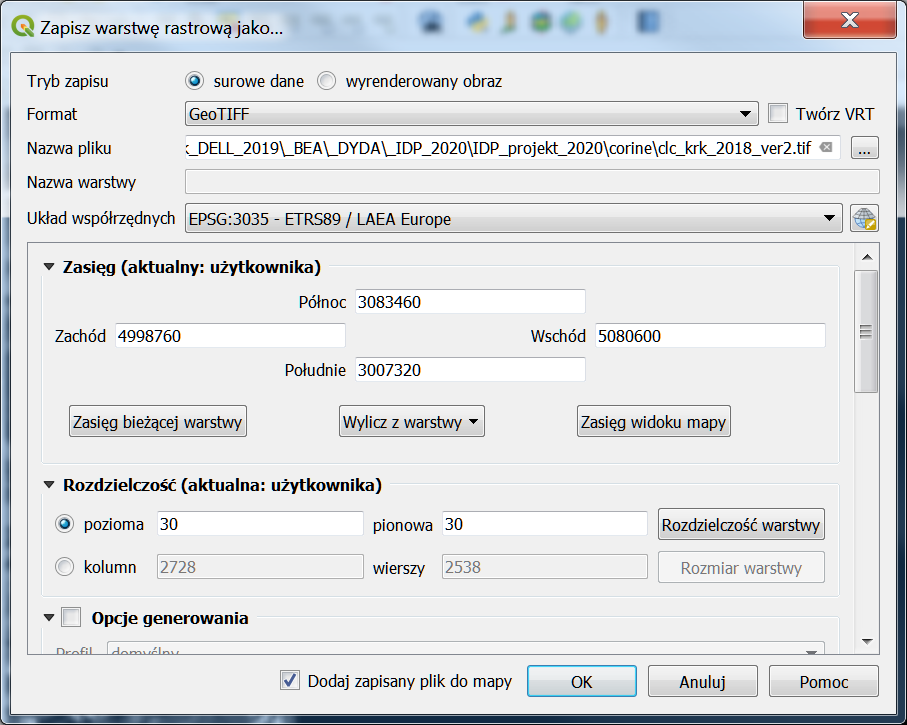
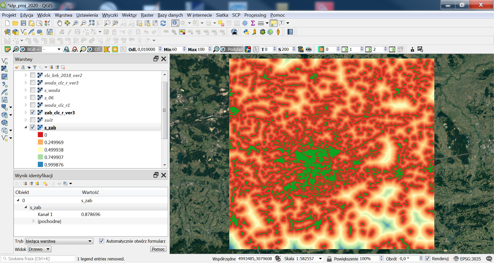

# IDP projekt 2020
---
Celem projektu jest "zabawa" z danymi przestrzennymi:

   - **z różnych źródeł**(korzystamy z dostępnych darmowych, np. FB https://www.facebook.com/GIS-573684803030360/ , https://www.kaggle.com/datasets, CORINE, Urban Atlas, SRTM, codgik, lub innych)
   - **w różnych modelach** (wektorowy, rastrowy, tabele atrybutów wymagające "geokodowania", czyli np. csv który ma id pozwalające na połączenie z inną tabelą, mającą już geometrię (jak EGIB), lub csv, który ma w kolumnach współrzędne, które można podać w QGIS geokodowaniu wczytując warstwę csv (tak jak dane o zanieczyszczeniu w Seulu, na stronie kaggle)), podając kolumny, w których są współrzędne
   - **w dwóch narzędziach**: Postgres/PostGIS i np. QGIS

Celem projektu jest integracja danych, a nie samo wykonywanie analizy przestrzennej. Czy w jajk największym stopniu poznajemy różnorodne możliwości przygotowania danych do dalszej analizy.

Webinar: https://fotogrametria.agh.edu.pl/~galia/idp_fdss/IDP_2020-04-06_13-06-22.mkv

## Model wektorowy, model rastrowy
W modelu wektorowym obiekty przedstawiane są za pomocą punktów, linii i poligonów, z wykorzystaniem współrzędnych. 

W modelu rastrowym obiekty przedstawiane są za pomocą macierzy o określonej liczbie kolumn i wierszy. Najmniejszym elementem macierzy jest piksel, w którym zapisana jest informacja, najczęściej liczba. W NMT jest to wysokość, w obrazie panchromatycznym jasność, w kolorowym 3 składowe RGB, czyli jasność w każdym z kanałów.

Najprostszym rastrem jest obraz panchromatyczny (powszechnie nazywany czarno-białym, bo przedstawiany w stopniach szarości, w palecie gray). Ponadto zwykle piksel zapisany jest na jednym bajcie, czyli 8 bitach i jego rozdzielczość radiometryczna wynosi 256=2^8 (wariacja z powtórzeniami, ile ciągów ośmioelementowych można utworzyć ze zbioru 2 elementowego (0,1)). Tyle jest unikalnych liczb, które są do dyspozycji, czyli im więcej tym więcej informacji na obrazie. Obraz kolorowy, zapisany na RGB składa się właściwie z trzech obrazów (R, G, B) i sumarycznie jeden piksel jest zapisany na 3*8, czyli 24 bitach (3 bajatach). Obecnie obrazy satelitarne zapisane są na większej liczbie bytów, np. obraz Sentinel zapisany jest na 16 bitach. 

Innym przykładem jest NMT, gdzie w każdym pikselu zapisana jest wysokość, czyli DN (tzw. digital number) = wysokość, musi to być liczba rzeczywista (typu float) lub integer (SRTM), ponieważ liczb typu bajt jest zbyt mało i są one zbyt małe (256 liczb do dyspozycji i do tego w zakresie 0-255).

W rastrze może być także zapisana inna informacja np. taka, jak w modelu wektorowym. Czyli obiekty punktowe, liniowe i poligony mogą występować zarówno w modelu wektorowym jak i rastrowym. 
Po mimo, że naturalnie obiekty typu: punkt, linia i poligon są zapisane w modelu wektorowym istnieją tego typu dane jednak zapisane w modelu rastrowym z tego powodu, że mogą zajmować znacznie mniej miejsca i dlatego, że ten model umożliwia znacznie więcej analiz niż model wektorowy. Przykładowo baza danych Corine w modelu wektorowym zajmuje ponad dwa gigabajty, a w modelu wektorowym ok. 200 megabajtów. W tym przypadku DN, wartość zapisana w pikselu, zwykle reprezentuje identyfikator klasy obiektów, czyli np. odpowiada typowi pokrycia terenu.

## Analizy w modelu wektorowym

Podstawowe analizy w modelu wektorowym:
- zapytanie poprzez atrybut: SQL
- buforowanie
- nakładanie np. przecięcie, różnica suma 

## Analizy w modelu rastrowym

Podstawowe analizy w modelu  rastrowym:
- zapytanie poprzez atrybut: reklasyfikacja
- obliczanie odległości=mapa odległości, nie tylko bufor o zadanej odległości
- nakładanie (algebra map): dodawanie, odejmowanie, mnożenie, dzielenie, dowolne funkcje algebraiczne

## Porównanie

1. W przypadku dużej liczby obiektów model wektorowy jest "ciężki", operacje analityczne trwają długo, proces "się wiesza", bardzo trudno  o "czyste" geometrycznie i topologicznie dane 

2. W modelu wektorowym nie można np. obliczyć w każdym miejscu odległości do najbliższego punktu o zadanym atrybucie (np. od wody)

3. Model rastrowy przechowuje dane w bardzo jednolitej i prostej formie macierzy. Pewną barierą jest rozdzielczość przestrzenna obrazu (im mniejszy piksel tym dokładniejsze dane, ale tym większy rozmiar), jednak w analizach przestrzennych nie jest potrzebna aż taka rozdzielczość jak w przypadku ortofotomap.

4. Wszystkie analizy przestrzenne są łatwiejsze i szybsze w modelu rastrowym, algebra map jest bardzo efektywnym narzędziem o bardzo dużych możliwościach

## Przykład

### Dane

1. Corine - w postaci rastrowej
2. Urban Atlas - w postaci wektorowej

Obie bazy są w układzie LAEA.

### Analiza rastrowa

#### Wycięcie fragmentu - wydaje się banalne i automatyczne, a ma spore następstwa, których znaczenie możemy zauważyć (albo nie) później.

W QGIS'ie możemy wyciąć (w legendzie prawy klawisz myszy-Eksportuj-Zapisz jako) "do widoku" lub do "zasięgu istniejącej warstwy", możemy też podać wielkość piksela. Problem polega na tym, że QGIS nie przymnie dokładnie takich wielkości piksela jak mu podaliśmy, nawet nie będzie to piksel kwadratowy - a to już może stanowić problem w analizach rastrowych, albo się nie będą wykonywać, zgłaszając "nieznany błąd", albo będą wykonywały w tle reampling, ujednolicając wielkość/wielkości piksela (w przypadku analizy wielu rastrów równocześnie) co oczywiście spowalnia analizy. Kluczowe jest przygotowanie rastra o wielkości piksela takiej, jak chcemy na prawdę, nie "na niby", w przybliżeniu.       

**Przykład Cornine.** Docięcie do zakresu warstwy: PL003L2_KRAKOW_UA2012_Boundary. W jednym przypadku automatycznie (podając wielkość piksela 30x30m). W drugim modyfikując xmin, xmax i ymin, ymax, taż żeby szerokość i wysokość rastra była podzielna bez reszty przez 30. Proszę zauważyć, że liczba kolumn i liczba wierszy w obu przykładkach jet taka sama. Natomiast różne wymiary piksela można zauważyć we właściwościach warstwy. 

#### Zapytanie poprzez atrybut, reklasyfikacja, znowu mina.

**"Pokaż wody"**

Zapytanie to można zrobić wykonać za pomocą opcji: min<wartość<=max.

To jest BTW odwrotnie niż w IDRISI, gdzie jest przedział jest lewostronnie zamknięty "[", prawostronnie otwarty ")".

Czyli dla wody w bazie Corine, id: 511 i 512, czyli należy podać [511, 513).

Reklasyfikację można wykonać w wersji z wartością "0" jako tło lub "no data" (obliczanie odległości jest możliwe w QGIS'ie tylko jeśli mamy klasę obiektu tło jako "no data"). W tym przypadku trzeba pamiętać o zaznaczeniu opcji "no data".

#### Zamiana rastra na wektor. 

W QGIS (górne menu) Raster-Konwersja-Poligonizuj (raster na wektor). Konwersja tą opcja zawsze zamienia wektor na poligon. Zamiana na inne typy obiektów: punkt, linia jest w programach rzadko dostępna, bo jest trudna.

#### Obliczenie odległości z narzędzi QGIS (SAGA-Raster tools-Proximity raster)

Obraz odległości pokazuje dla każdego piksela odległość do najbliższej wody (operacja niemożliwa do wykonania w modelu wektorowym). Zamiast obszaru oddalonego o zadaną wartość bufora od wody mamy ciągły rozkład odległości.

#### Teraz możemy porównać nasze dane z Corine z UA, w modelu wektorowym

Można wykonać analizę ilościową warstwy wód (taką analizę będziecie wykonywali na innych danych u Pana Prof. Pyki w dalszej części zajęć)

Mapę odległości można wykorzystać w bardziej zaawansowanych analizach wyboru lokalizacji - przykład poniżej

#### Zamiana wektora na raster 

W tym przypadku tworzony jest nowy raster i dlatego trzeba bardzo uważać jakie są jego rozmiary (xmin,xmax, ymin, ymax, liczba kolumn, wierszy i wielkość pisela) - podobnie jak podczas zapisywania rastra, można użyć innego rastra o ile uważnie go utworzyliśmy
W QGIS (górne menu) Raster-Konwersja-Rasteryzuj (wektor na raster). Konwersja na raster jest prostsza niż rastra na wektor.

#### Analiza klas obiektów w modelu rastrowym 

Analiza w modelu rastrowym jest jest prostsza w modelu rastrowym. Używamy do tego algebry map. QGIS, górne menu-raster-Kalkulator rastra, np. dodawanie rastrów. 

### Projekt przykładowy 

Celem projektu jest znalezienie lokalizacji dla "dzikusa", czyli, jak najdalej od zabudowy i jak najbliżej do wody. Możemy zdefiniować, jak zwykle, przyjmując konkretne wartości buforów, czyli np.  500 m od zabudowy i 500 od wody. Przy czym nie wiemy, czy w ogóle uzyskamy jakiś wynik, ponieważ może nie być terenów, spełniających warunki, które sobie przyjęliśmy.  Możemy podejść do tego inaczej, czyli wyznaczyć lokalizację tzw. "metodą miękką". Wykonamy to zgodnie ze schematem.

Użyjemy danych Corine, oraz trzech funkcji, z różnych "miejsc" w QGIS'ie: panelu algorytmów, SAGI i Kalkulatora. Najpierw utworzymy nakładki: woda i zabudowa. Potem obliczymy w sposób ciągły odległości od wody i zabudowy. Odległości na mapach odległości są w metrach, więc nie można ich bezpośrednio porównać. W związku z tym dokonujemy ich standaryzacji, najprościej liniowo do wartości (0,1). Stworzymy w ten sposób mapy przydatności biorąc pod uwagę odległość od wody i zabudowy. Czyli im większa wartość przydatności na mapie przydatności tym lepiej (max=1, min=0). Ostatecznie możemy obliczyć średnią wartość przydatności, zwykłą lub ważoną. Uzyskamy mapę przedstawiającą ciągły rozkład przydatności (wartości przydatności od 0 do 1) zamiast bitmapy, na której mamy tylko dwie wartości: 1 - przydatny, 0 lub nodata - nieprzydatny). DN na takiej mapie oznacza stopień przydatności danego piksela do naszego celu.  

CORINE wycinek

Woda (tło=no data)

Mapa odległości od zabudowy (zauważyć wartości DN=odległość w [m] w oknie warstwy)

Mapa odległości od zabudowy, po standaryzacji (zauważyć wartości DN (0,1) w oknie warstwy)

Mapa sumarycznej przydatności (średnia przydatność (0,1))

Porównanie analizy wektorowej i miękkiej rastrowej.

W kolorze:

-  szarym - zabudowa
-  niebieskim - woda
-  fioletowym - bliżej niż 500 m do wody i dalej niż 500 od zabudowy
-  czerwonym - im blizeej do wody tym lepiej i im dalej od zabudowy tym lepiej

Analizy rastrowe pozwalają na bardziej elastyczne modelowanie (więcej na przedmiocie: Zaawansowany GIS)
 

